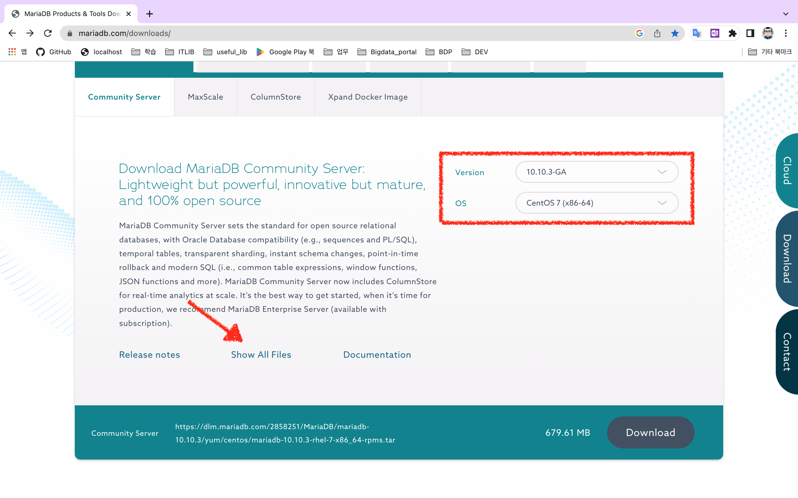
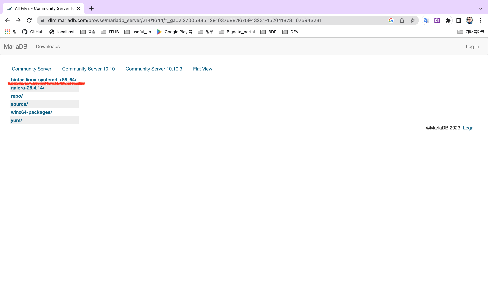
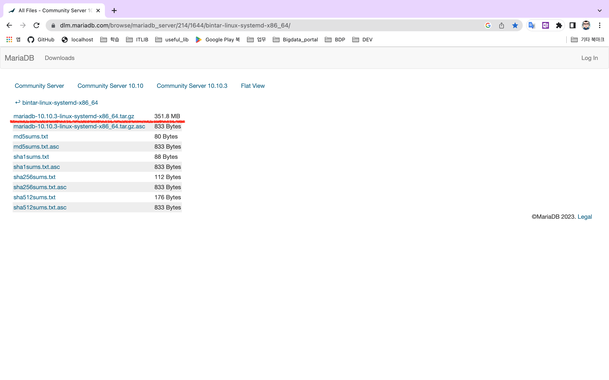

# MariaDB 설치

[TOC]

## 설치 파일 다운로드

### MariaDB Community Server 10.10.3 다운로드

#### 1) Version, OS 선택



#### 2) bintar-linux-systemd-x86_64 선택



#### 3) mariadb-10.10.3-linux-systemd-x86_64.tar.gz 선택



------


### 유저 및 그룹 생성

```bash
[root@kcwbigsv03t ~]# groupadd mysql
[root@kcwbigsv03t ~]# useradd -g mysql mysql
[root@kcwbigsv03t ~]# ll /home
합계 0
drwx------. 3 kkcomwel kkcomwel 82  2월  9 17:14 kkcomwel
drwx------. 2 mysql    mysql    62  2월  9 17:39 mysql
```

### 파일 이동

```bash
[root@kcwbigsv03t upload_files]# mv mariadb-10.10.3-linux-systemd-x86_64.tar.gz /usr/local
[root@kcwbigsv03t upload_files]# cd /usr/local
[root@kcwbigsv03t local]# ll
합계 343592
drwxr-xr-x. 2 root     root             6  4월 11  2018 bin
drwxr-xr-x. 2 root     root             6  4월 11  2018 etc
drwxr-xr-x. 2 root     root             6  4월 11  2018 games
drwxr-xr-x. 2 root     root             6  4월 11  2018 include
drwxr-xr-x. 2 root     root             6  4월 11  2018 lib
drwxr-xr-x. 2 root     root             6  4월 11  2018 lib64
drwxr-xr-x. 2 root     root             6  4월 11  2018 libexec
-rw-rw-r--. 1 kkcomwel kkcomwel 351836014  2월  9 19:57 mariadb-10.10.3-linux-systemd-x86_64.tar.gz
drwxr-xr-x. 2 root     root             6  4월 11  2018 sbin
drwxr-xr-x. 5 root     root            49  2월  9 16:47 share
drwxr-xr-x. 2 root     root             6  4월 11  2018 src
```

### 압축 해제

```bash
[root@kcwbigsv03t local]# tar -xvf mariadb-10.10.3-linux-systemd-x86_64.tar.gz
```

### 권한 변경(mysql 계정)

```bash
[root@kcwbigsv03t local]# chown -R mysql:mysql mariadb-10.10.3-linux-systemd-x86_64
[root@kcwbigsv03t local]# ll
합계 343592
drwxr-xr-x.  2 root     root             6  4월 11  2018 bin
drwxr-xr-x.  2 root     root             6  4월 11  2018 etc
drwxr-xr-x.  2 root     root             6  4월 11  2018 games
drwxr-xr-x.  2 root     root             6  4월 11  2018 include
drwxr-xr-x.  2 root     root             6  4월 11  2018 lib
drwxr-xr-x.  2 root     root             6  4월 11  2018 lib64
drwxr-xr-x.  2 root     root             6  4월 11  2018 libexec
drwxrwxr-x. 12 mysql    mysql          257  2월  3 05:05 mariadb-10.10.3-linux-systemd-x86_64
-rw-rw-r--.  1 kkcomwel kkcomwel 351836014  2월  9 19:57 mariadb-10.10.3-linux-systemd-x86_64.tar.gz
drwxr-xr-x.  2 root     root             6  4월 11  2018 sbin
drwxr-xr-x.  5 root     root            49  2월  9 16:47 share
drwxr-xr-x.  2 root     root             6  4월 11  2018 src
```

### 심볼릭 링크 생성

```bash
[root@kcwbigsv03t local]# ln -s ./mariadb-10.10.3-linux-systemd-x86_64 /usr/local/mysql
[root@kcwbigsv03t local]# ll
합계 343592
drwxr-xr-x.  2 root     root             6  4월 11  2018 bin
drwxr-xr-x.  2 root     root             6  4월 11  2018 etc
drwxr-xr-x.  2 root     root             6  4월 11  2018 games
drwxr-xr-x.  2 root     root             6  4월 11  2018 include
drwxr-xr-x.  2 root     root             6  4월 11  2018 lib
drwxr-xr-x.  2 root     root             6  4월 11  2018 lib64
drwxr-xr-x.  2 root     root             6  4월 11  2018 libexec
drwxrwxr-x. 12 mysql    mysql          257  2월  3 05:05 mariadb-10.10.3-linux-systemd-x86_64
-rw-rw-r--.  1 kkcomwel kkcomwel 351836014  2월  9 19:57 mariadb-10.10.3-linux-systemd-x86_64.tar.gz
lrwxrwxrwx.  1 root     root            38  2월  9 20:02 mysql -> ./mariadb-10.10.3-linux-systemd-x86_64
drwxr-xr-x.  2 root     root             6  4월 11  2018 sbin
drwxr-xr-x.  5 root     root            49  2월  9 16:47 share
drwxr-xr-x.  2 root     root             6  4월 11  2018 src

[root@kcwbigsv03t local]# chown -R mysql:mysql mysql
[root@kcwbigsv03t local]# ll
합계 343592
drwxr-xr-x.  2 root     root             6  4월 11  2018 bin
drwxr-xr-x.  2 root     root             6  4월 11  2018 etc
drwxr-xr-x.  2 root     root             6  4월 11  2018 games
drwxr-xr-x.  2 root     root             6  4월 11  2018 include
drwxr-xr-x.  2 root     root             6  4월 11  2018 lib
drwxr-xr-x.  2 root     root             6  4월 11  2018 lib64
drwxr-xr-x.  2 root     root             6  4월 11  2018 libexec
drwxrwxr-x. 12 mysql    mysql          257  2월  3 05:05 mariadb-10.10.3-linux-systemd-x86_64
-rw-rw-r--.  1 kkcomwel kkcomwel 351836014  2월  9 19:57 mariadb-10.10.3-linux-systemd-x86_64.tar.gz
lrwxrwxrwx.  1 mysql    mysql           38  2월  9 20:02 mysql -> ./mariadb-10.10.3-linux-systemd-x86_64
drwxr-xr-x.  2 root     root             6  4월 11  2018 sbin
drwxr-xr-x.  5 root     root            49  2월  9 16:47 share
drwxr-xr-x.  2 root     root             6  4월 11  2018 src
```

### my.cnf 파일 생성

```shell
[mysqld]
character-set-server=utf8mb4
collation-server=utf8mb4_general_ci

basedir=/usr/local/mysql
datadir=/APP/mysql/data

[mysqld_safe]
log-error=/var/lib/mysql/log/mariadb.log
pid-file=/var/run/mariadb/mariadb.pidd
```

## MariaDB 설치

```bash
[root@kcwbigsv03t scripts]# ./mysql_install_db --user=mysql --basedir=/usr/local/mysql --datadir=/APP/mysql/data
Installing MariaDB/MySQL system tables in '/APP/mysql/data' ...
OK
#################################
<참고> system root 계정의 패스워드 없이 mariadb root 권한 획득 방지를 위한 옵션 (테스트 해보진 않았음)
./mysql_install_db --auth-root-authentication-method=normal
#################################
To start mariadbd at boot time you have to copy
support-files/mariadb.service to the right place for your system


Two all-privilege accounts were created.
One is root@localhost, it has no password, but you need to
be system 'root' user to connect. Use, for example, sudo mysql
The second is mysql@localhost, it has no password either, but
you need to be the system 'mysql' user to connect.
After connecting you can set the password, if you would need to be
able to connect as any of these users with a password and without sudo

See the MariaDB Knowledgebase at https://mariadb.com/kb

You can start the MariaDB daemon with:
cd '/usr/local/mysql' ; /usr/local/mysql/bin/mariadb-safe --datadir='/APP/mysql/data'

You can test the MariaDB daemon with mysql-test-run.pl
cd '/usr/local/mysql/mysql-test' ; perl mariadb-test-run.pl

Please report any problems at https://mariadb.org/jira

The latest information about MariaDB is available at https://mariadb.org/.

Consider joining MariaDB's strong and vibrant community:
https://mariadb.org/get-involved/
```

### systemd 서비스 등록

```bash
[root@kcwbigsv03t scripts]# cd /usr/local/mysql/support-files/systemd
[root@kcwbigsv03t systemd]# ll
합계 32
-rw-r--r--. 1 mysql mysql   509  2월  2 02:37 mariadb-extra@.socket
-rw-r--r--. 1 mysql mysql  5910  2월  2 02:37 mariadb.service
-rw-r--r--. 1 mysql mysql 10056  2월  2 02:37 mariadb@.service
-rw-r--r--. 1 mysql mysql   570  2월  2 02:37 mariadb@.socket
lrwxrwxrwx. 1 mysql mysql    17  2월  2 02:55 mysql.service -> ./mariadb.service
lrwxrwxrwx. 1 mysql mysql    17  2월  2 02:55 mysqld.service -> ./mariadb.service
-rw-r--r--. 1 mysql mysql   676  2월  2 02:30 use_galera_new_cluster.conf
[root@kcwbigsv03t systemd]# vi mariadb.service			# user, group 이 mysql로 지정되어 있는지 확인
[root@kcwbigsv03t systemd]# cp mariadb.service /etc/systemd/system/
```

### 서비스 시작

```bash
[root@kcwbigsv03t systemd]# systemctl daemon-reload
[root@kcwbigsv03t ~]# systemctl status mariadb.service
● mariadb.service - MariaDB 10.10.3 database server
   Loaded: loaded (/etc/systemd/system/mariadb.service; disabled; vendor preset: disabled)
   Active: active (running) since 목 2023-02-09 20:28:23 KST; 12s ago
     Docs: man:mariadbd(8)
           https://mariadb.com/kb/en/library/systemd/
  Process: 14582 ExecStartPost=/bin/sh -c systemctl unset-environment _WSREP_START_POSITION (code=exited, status=0/SUCCESS)
  Process: 14540 ExecStartPre=/bin/sh -c [ ! -e /usr/local/mysql/bin/galera_recovery ] && VAR= ||   VAR=`cd /usr/local/mysql/bin/..; /usr/local/mysql/bin/galera_recovery`; [ $? -eq 0 ]   && systemctl set-environment _WSREP_START_POSITION=$VAR || exit 1 (code=exited, status=0/SUCCESS)
  Process: 14538 ExecStartPre=/bin/sh -c systemctl unset-environment _WSREP_START_POSITION (code=exited, status=0/SUCCESS)
 Main PID: 14563 (mariadbd)
   Status: "Taking your SQL requests now..."
   CGroup: /system.slice/mariadb.service
           └─14563 /usr/local/mysql/bin/mariadbd

 2월 09 20:28:12 kcwbigsv03t mariadbd[14563]: 2023-02-09 20:28:12 0 [Note] InnoDB: File './ibt...iB.
 2월 09 20:28:12 kcwbigsv03t mariadbd[14563]: 2023-02-09 20:28:12 0 [Note] InnoDB: log sequenc... 14
 2월 09 20:28:12 kcwbigsv03t mariadbd[14563]: 2023-02-09 20:28:12 0 [Note] Plugin 'FEEDBACK' i...ed.
 2월 09 20:28:12 kcwbigsv03t mariadbd[14563]: 2023-02-09 20:28:12 0 [Note] InnoDB: Loading buf...ool
 2월 09 20:28:12 kcwbigsv03t mariadbd[14563]: 2023-02-09 20:28:12 0 [Note] Server socket creat...0'.
 2월 09 20:28:12 kcwbigsv03t mariadbd[14563]: 2023-02-09 20:28:12 0 [Note] Server socket creat...:'.
 2월 09 20:28:23 kcwbigsv03t mariadbd[14563]: 2023-02-09 20:28:23 0 [Note] InnoDB: Buffer pool...:23
 2월 09 20:28:23 kcwbigsv03t mariadbd[14563]: 2023-02-09 20:28:23 0 [Note] /usr/local/mysql/bi...ns.
 2월 09 20:28:23 kcwbigsv03t mariadbd[14563]: Version: '10.10.3-MariaDB'  socket: '/tmp/mysql....ver
 2월 09 20:28:23 kcwbigsv03t systemd[1]: Started MariaDB 10.10.3 database server.
Hint: Some lines were ellipsized, use -l to show in full.
```

### MariaDB 접속

```bash
[root@kcwbigsv03t systemd]# mysql -uroot
Welcome to the MariaDB monitor.  Commands end with ; or \g.
Your MariaDB connection id is 3
Server version: 10.10.3-MariaDB MariaDB Server

Copyright (c) 2000, 2018, Oracle, MariaDB Corporation Ab and others.

Type 'help;' or '\h' for help. Type '\c' to clear the current input statement.

MariaDB [(none)]>
```

### root 계정 패스워드 설정

```bash
MariaDB [mysql]> use mysql
Database changed
MariaDB [mysql]> select host, user, password, plugin from user;
+-------------+-------------+-------------------------------------------+-----------------------+
| Host        | User        | Password                                  | plugin                |
+-------------+-------------+-------------------------------------------+-----------------------+
| localhost   | mariadb.sys |                                           | mysql_native_password |
| localhost   | root        | *A4B6157319038724E3560894F7F932C8886EBFCF | mysql_native_password |
| localhost   | mysql       | invalid                                   | mysql_native_password |
| localhost   |             |                                           |                       |
| kcwbigsv03t |             |                                           |                       |
+-------------+-------------+-------------------------------------------+-----------------------+
MariaDB [mysql]> set password for 'root'@'localhost' = password('1234');
Query OK, 0 rows affected (0.003 sec)

MariaDB [mysql]> flush privileges;
Query OK, 0 rows affected (0.001 sec)

MariaDB [mysql]> select host, user, password, plugin from user;
+-------------+-------------+-------------------------------------------+-----------------------+
| Host        | User        | Password                                  | plugin                |
+-------------+-------------+-------------------------------------------+-----------------------+
| localhost   | mariadb.sys |                                           | mysql_native_password |
| localhost   | root        | *A4B6157319038724E3560894F7F932C8886EBFCF | mysql_native_password |
| localhost   | mysql       | invalid                                   | mysql_native_password |
| localhost   |             |                                           |                       |
| kcwbigsv03t |             |                                           |                       |
+-------------+-------------+-------------------------------------------+-----------------------+
5 rows in set (0.001 sec)
```

#### (참고) root 패스워드 변경 방법

```bash
MariaDB [mysql]> alter user 'root'@'localhost' identified by '0000';
Query OK, 0 rows affected (0.003 sec)

MariaDB [mysql]> set password=password('1111');
Query OK, 0 rows affected (0.002 sec)
```


## MariaDB 접속 테스트

### !! system root 계정으로 접속 할 때는 password를 물어보지 않는다

```bash
[root@kcwbigsv03t ~]# mysql -u root
Welcome to the MariaDB monitor.  Commands end with ; or \g.
Your MariaDB connection id is 3
Server version: 10.10.3-MariaDB MariaDB Server

Copyright (c) 2000, 2018, Oracle, MariaDB Corporation Ab and others.

Type 'help;' or '\h' for help. Type '\c' to clear the current input statement.

MariaDB [(none)]> use mysql;
Reading table information for completion of table and column names
You can turn off this feature to get a quicker startup with -A

Database changed
MariaDB [mysql]> select host, user, password, plugin from user;
+-------------+-------------+-------------------------------------------+-----------------------+
| Host        | User        | Password                                  | plugin                |
+-------------+-------------+-------------------------------------------+-----------------------+
| localhost   | mariadb.sys |                                           | mysql_native_password |
| localhost   | root        | *A4B6157319038724E3560894F7F932C8886EBFCF | mysql_native_password |
| localhost   | mysql       | invalid                                   | mysql_native_password |
| localhost   |             |                                           |                       |
| kcwbigsv03t |             |                                           |                       |
+-------------+-------------+-------------------------------------------+-----------------------+
5 rows in set (0.001 sec)

MariaDB [mysql]>
```

#### 10.4 버전 이후 이슈 사항

* system root 계정에서는 패스워드를 요구하지 않는다
* user 테이블은 실제 테이블이 아님
  * mysql.global_priv 테이블의 내용을 기반으로 내용만 보여줌


### system root 계정이 아닐경우 패스워드 없이 로그인 되지 않는다

```bash
[mysql@kcwbigsv03t ~]$ mysql -u root
ERROR 1698 (28000): Access denied for user 'root'@'localhost'
[mysql@kcwbigsv03t ~]$ mysql -u root -p
Enter password:
Welcome to the MariaDB monitor.  Commands end with ; or \g.
Your MariaDB connection id is 5
Server version: 10.10.3-MariaDB MariaDB Server

Copyright (c) 2000, 2018, Oracle, MariaDB Corporation Ab and others.

Type 'help;' or '\h' for help. Type '\c' to clear the current input statement.

MariaDB [(none)]>
```

## 데이터베이스 생성

```bash
MariaDB [mysql]> create database bigdatamart;
Query OK, 1 row affected (0.007 sec)

MariaDB [mysql]> show databases;
+--------------------+
| Database           |
+--------------------+
| bigdatamart        |
| information_schema |
| mysql              |
| performance_schema |
| sys                |
| test               |
+--------------------+
6 rows in set (0.000 sec)

# create dabase if not exists bigdatamart;
```

### 데이터베이스 삭제

```bash
MariaDB [mysql]> drop database bigdatamart;
Query OK, 0 rows affected (0.102 sec)

MariaDB [mysql]> show databases;
+--------------------+
| Database           |
+--------------------+
| information_schema |
| mysql              |
| performance_schema |
| sys                |
| test               |
+--------------------+
5 rows in set (0.000 sec)
```

### 데이터베이스 이름 변경 (mysqldump)

```bash
# 1) 새로운 이름의 데이터베이스를 만든다
# 2) mysqldump 로 데이터베이스를 백업한다
# 3) 새로운 이름의 데이터베이스로 복구한다

[root@kcwbigsv03t ~]# mysqldump -u root -p testdb > testdb.sql
Enter password:
[root@kcwbigsv03t ~]# ll
합계 8
-rw-------. 1 root root 1414  2월  9 16:51 anaconda-ks.cfg
-rw-r--r--. 1 root root 1278  2월  9 19:28 testdb.sql
[root@kcwbigsv03t ~]# cat testdb.sql
-- MariaDB dump 10.19  Distrib 10.10.3-MariaDB, for linux-systemd (x86_64)
--
-- Host: localhost    Database: testdb
-- ------------------------------------------------------
-- Server version	10.10.3-MariaDB

/*!40101 SET @OLD_CHARACTER_SET_CLIENT=@@CHARACTER_SET_CLIENT */;
/*!40101 SET @OLD_CHARACTER_SET_RESULTS=@@CHARACTER_SET_RESULTS */;
/*!40101 SET @OLD_COLLATION_CONNECTION=@@COLLATION_CONNECTION */;
/*!40101 SET NAMES utf8mb4 */;
/*!40103 SET @OLD_TIME_ZONE=@@TIME_ZONE */;
/*!40103 SET TIME_ZONE='+00:00' */;
/*!40014 SET @OLD_UNIQUE_CHECKS=@@UNIQUE_CHECKS, UNIQUE_CHECKS=0 */;
/*!40014 SET @OLD_FOREIGN_KEY_CHECKS=@@FOREIGN_KEY_CHECKS, FOREIGN_KEY_CHECKS=0 */;
/*!40101 SET @OLD_SQL_MODE=@@SQL_MODE, SQL_MODE='NO_AUTO_VALUE_ON_ZERO' */;
/*!40111 SET @OLD_SQL_NOTES=@@SQL_NOTES, SQL_NOTES=0 */;
/*!40103 SET TIME_ZONE=@OLD_TIME_ZONE */;

/*!40101 SET SQL_MODE=@OLD_SQL_MODE */;
/*!40014 SET FOREIGN_KEY_CHECKS=@OLD_FOREIGN_KEY_CHECKS */;
/*!40014 SET UNIQUE_CHECKS=@OLD_UNIQUE_CHECKS */;
/*!40101 SET CHARACTER_SET_CLIENT=@OLD_CHARACTER_SET_CLIENT */;
/*!40101 SET CHARACTER_SET_RESULTS=@OLD_CHARACTER_SET_RESULTS */;
/*!40101 SET COLLATION_CONNECTION=@OLD_COLLATION_CONNECTION */;
/*!40111 SET SQL_NOTES=@OLD_SQL_NOTES */;

-- Dump completed on 2023-02-09 19:28:30
[root@kcwbigsv03t ~]# mysql -u root -p testdb1 < testdb.sql
Enter password:
```


## 외부 접속용 계정 생성

```bash
MariaDB [mysql]> create user us_django@'%' identified by '1234';
Query OK, 0 rows affected (0.005 sec)

MariaDB [mysql]> grant all privileges on testdb.* to 'us_django'@'%';
Query OK, 0 rows affected (0.008 sec)

MariaDB [mysql]> flush privileges;
Query OK, 0 rows affected (0.001 sec)

MariaDB [mysql]> show grants for us_django@'%';
+----------------------------------------------------------------------------------------------------------+
| Grants for us_django@%                                                                                   |
+----------------------------------------------------------------------------------------------------------+
| GRANT USAGE ON *.* TO `us_django`@`%` IDENTIFIED BY PASSWORD '*A4B6157319038724E3560894F7F932C8886EBFCF' |
| GRANT ALL PRIVILEGES ON `testdb`.* TO `us_django`@`%`                                                    |
+----------------------------------------------------------------------------------------------------------+
2 rows in set (0.000 sec)
```

tomcat을 연결할때, 외부접속 권한으로 'us_django'@'localhost' 계정도 생성해줘야 한다

### 계정 삭제

```bash
MariaDB [mysql]> drop user mysql@'%';
Query OK, 0 rows affected (0.187 sec)

MariaDB [mysql]> select host, user, password, plugin from user;
+-------------+-------------+-------------------------------------------+-----------------------+
| Host        | User        | Password                                  | plugin                |
+-------------+-------------+-------------------------------------------+-----------------------+
| localhost   | mariadb.sys |                                           | mysql_native_password |
| localhost   | root        | *A4B6157319038724E3560894F7F932C8886EBFCF | mysql_native_password |
| localhost   | mysql       | invalid                                   | mysql_native_password |
| localhost   |             |                                           |                       |
| kcwbigsv03t |             |                                           |                       |
+-------------+-------------+-------------------------------------------+-----------------------+
5 rows in set (0.019 sec)
```

**Query OK, 0 rows affected (0.187 sec)** 가 출력되었지만, 계정은 삭제 됨

------

### 계정별 권한 확인

```bash
MariaDB [mysql]> show grants for mysql@'%';
+------------------------------------------------------------------------------------------------------+
| Grants for mysql@%                                                                                   |
+------------------------------------------------------------------------------------------------------+
| GRANT USAGE ON *.* TO `mysql`@`%` IDENTIFIED BY PASSWORD '*A4B6157319038724E3560894F7F932C8886EBFCF' |
+------------------------------------------------------------------------------------------------------+
1 row in set (0.000 sec)

MariaDB [mysql]> show grants for mysql@'localhost';
+------------------------------------------------------------------------------------------------------------------------------------------+
| Grants for mysql@localhost                                                                                                               |
+------------------------------------------------------------------------------------------------------------------------------------------+
| GRANT ALL PRIVILEGES ON *.* TO `mysql`@`localhost` IDENTIFIED VIA mysql_native_password USING 'invalid' OR unix_socket WITH GRANT OPTION |
+------------------------------------------------------------------------------------------------------------------------------------------+
1 row in set (0.010 sec)
```

#### 권한 삭제

```bash
MariaDB [mysql]> show grants for us_django@'%';
+----------------------------------------------------------------------------------------------------------+
| Grants for us_django@%                                                                                   |
+----------------------------------------------------------------------------------------------------------+
| GRANT USAGE ON *.* TO `us_django`@`%` IDENTIFIED BY PASSWORD '*A4B6157319038724E3560894F7F932C8886EBFCF' |
| GRANT ALL PRIVILEGES ON `testdb`.* TO `us_django`@`%`                                                    |
+----------------------------------------------------------------------------------------------------------+
2 rows in set (0.000 sec)			# 2개의 권한

MariaDB [mysql]> revoke all privileges on testdb.* from us_django@'%';
Query OK, 0 rows affected (0.006 sec)

MariaDB [mysql]> show grants for us_django@'%';
+----------------------------------------------------------------------------------------------------------+
| Grants for us_django@%                                                                                   |
+----------------------------------------------------------------------------------------------------------+
| GRANT USAGE ON *.* TO `us_django`@`%` IDENTIFIED BY PASSWORD '*A4B6157319038724E3560894F7F932C8886EBFCF' |
+----------------------------------------------------------------------------------------------------------+
1 row in set (0.000 sec)			# 1개가 삭제됨, 로그인 권한만 남김

# (참고) 권한을 부여할때는 select, update, insert, delete 각각 부여 가능
# 권한을 삭제할때는 개별적으로 삭제 안됨

MariaDB [mysql]> grant select on testdb.* to us_django@'%';
Query OK, 0 rows affected (0.004 sec)

MariaDB [mysql]> show grants for us_django@'%';
+----------------------------------------------------------------------------------------------------------+
| Grants for us_django@%                                                                                   |
+----------------------------------------------------------------------------------------------------------+
| GRANT USAGE ON *.* TO `us_django`@`%` IDENTIFIED BY PASSWORD '*A4B6157319038724E3560894F7F932C8886EBFCF' |
| GRANT SELECT ON `testdb`.* TO `us_django`@`%`                                                            |
+----------------------------------------------------------------------------------------------------------+
2 rows in set (0.000 sec)

MariaDB [mysql]> grant update on testdb.* to us_django@'%';
Query OK, 0 rows affected (0.003 sec)

MariaDB [mysql]> show grants for us_django@'%';
+----------------------------------------------------------------------------------------------------------+
| Grants for us_django@%                                                                                   |
+----------------------------------------------------------------------------------------------------------+
| GRANT USAGE ON *.* TO `us_django`@`%` IDENTIFIED BY PASSWORD '*A4B6157319038724E3560894F7F932C8886EBFCF' |
| GRANT SELECT, UPDATE ON `testdb`.* TO `us_django`@`%`                                                    |
+----------------------------------------------------------------------------------------------------------+
2 rows in set (0.000 sec)

MariaDB [mysql]> grant insert on testdb.* to us_django@'%';
Query OK, 0 rows affected (0.003 sec)

MariaDB [mysql]> show grants for us_django@'%';
+----------------------------------------------------------------------------------------------------------+
| Grants for us_django@%                                                                                   |
+----------------------------------------------------------------------------------------------------------+
| GRANT USAGE ON *.* TO `us_django`@`%` IDENTIFIED BY PASSWORD '*A4B6157319038724E3560894F7F932C8886EBFCF' |
| GRANT SELECT, INSERT, UPDATE ON `testdb`.* TO `us_django`@`%`                                            |
+----------------------------------------------------------------------------------------------------------+
2 rows in set (0.000 sec)

MariaDB [mysql]> grant delete on testdb.* to us_django@'%';
Query OK, 0 rows affected (0.003 sec)

MariaDB [mysql]> show grants for us_django@'%';
+----------------------------------------------------------------------------------------------------------+
| Grants for us_django@%                                                                                   |
+----------------------------------------------------------------------------------------------------------+
| GRANT USAGE ON *.* TO `us_django`@`%` IDENTIFIED BY PASSWORD '*A4B6157319038724E3560894F7F932C8886EBFCF' |
| GRANT SELECT, INSERT, UPDATE, DELETE ON `testdb`.* TO `us_django`@`%`                                    |
+----------------------------------------------------------------------------------------------------------+
2 rows in set (0.000 sec)
```

## Client 프로그램 설치

### Mac 용 Sequel Ace 설치


MySQL_Bench로도 접속이 가능하지만, 계속 오류 메세지가 나온다

사용해 보니 Sequel Ace도 충분하고, Windows 환경에서는 Hiedi SQL 을 사용하면 될 것 같다

다운로드 : https://sequel-ace.com/
