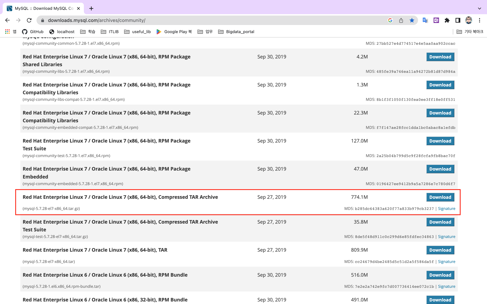
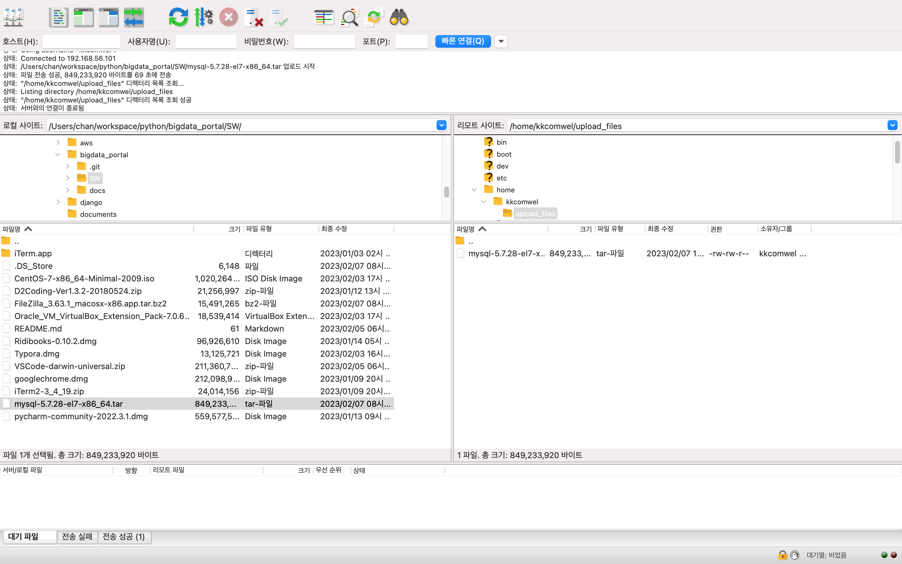

# 2. CentOS7에 MySQL 설치

[TOC]


### 1. mysql 5.7.28 다운로드 (mysql-5.7.28-el7-x86_64.tar.gz)




### 2. 다운로드 받은 파일을 서버로 업로드 한다

##### 실제 운영환경과 동일하게 하기 위해, kkcomwel 계정으로 업로드 한다

> fileziller를 설치해서 사용한다. App 스토어에 있는 건 pro 버전으로, 공식 사이트에서 다운로드 받아서 설치한다.
>
> 공식사이트 : https://filezilla-project.org/




### 3. 기존 설치되어 있는 mariadb 삭제 및 사용자 계정 생성(mysql)

```bash
[root@kcwbigsv01t /]# rpm -qa | grep maria
mariadb-libs-5.5.68-1.el7.x86_64
[root@kcwbigsv01t /]# rpm -ev --nodeps mariadb-libs-5.5.68-1.el7.x86_64
Preparing packages...
mariadb-libs-1:5.5.68-1.el7.x86_64
[root@kcwbigsv01t /]# rpm -qa | grep maria
[root@kcwbigsv01t /]# groupadd mysql
[root@kcwbigsv01t /]# useradd -g mysql mysql
[root@kcwbigsv01t /]#
```


### 4. 설치 파일 압축해제 (root 계정) 및 권한 변경

```bash
# 압축해제 1. 
[root@kcwbigsv01t upload_files]# tar -xvf mysql-5.7.28-el7-x86_64.tar
mysql-5.7.28-el7-x86_64.tar.gz
mysql-test-5.7.28-el7-x86_64.tar.gz
[root@kcwbigsv01t upload_files]# ll
합계 1658664
-rw-rw-r--. 1 kkcomwel kkcomwel 849233920  2월  6 23:19 mysql-5.7.28-el7-x86_64.tar
-rw-r--r--. 1     7161    31415 811676432  9월 27  2019 mysql-5.7.28-el7-x86_64.tar.gz
-rw-r--r--. 1     7161    31415  37553082  9월 27  2019 mysql-test-5.7.28-el7-x86_64.tar.gz

# /var/lib 디렉토리로 이동
[root@kcwbigsv01t upload_files]# mv mysql-5.7.28-el7-x86_64.tar.gz /var/lib/
[root@kcwbigsv01t upload_files]# cd /var/lib
[root@kcwbigsv01t lib]# pwd
/var/lib
[root@kcwbigsv01t lib]# ll
합계 792656
drwx------. 2 root    root          170  2월  6 23:28 NetworkManager
drwxr-xr-x. 2 root    root           55  2월  6 05:09 alternatives
drwx------. 3 root    root           18  2월  6 05:12 authconfig
drwxr-xr-x. 2 chrony  chrony         19  2월  6 06:38 chrony
drwxr-xr-x. 2 root    root            6  9월 30  2020 dbus
drwxr-xr-x. 2 root    root            6 10월  1  2020 dhclient
drwxr-xr-x. 2 root    root            6  4월 11  2018 games
drwxr-xr-x. 2 root    root            6  9월 30  2020 initramfs
drwxr-xr-x. 2 root    root           30  2월  6 06:21 logrotate
drwx------. 2 root    root            6  2월  6 05:08 machines
drwxr-xr-x. 2 root    root           37  2월  6 05:19 misc
-rw-r--r--. 1    7161   31415 811676432  9월 27  2019 mysql-5.7.28-el7-x86_64.tar.gz
drwxr-xr-x. 2 root    root            6 11월  5  2016 os-prober
drwxr-xr-x. 2 root    root           27  2월  6 05:09 plymouth
drwxr-x---. 3 root    polkitd        28  2월  6 05:08 polkit-1
drwx------. 2 postfix root           25  2월  6 05:19 postfix
drwxr-xr-x. 2 root    root          263  2월  6 23:17 rpm
drwxr-xr-x. 2 root    root            6  4월 11  2018 rpm-state
drwx------. 2 root    root           29  2월  6 23:38 rsyslog
drwxr-xr-x. 4 root    root           35  2월  6 05:08 stateless
drwxr-xr-x. 4 root    root           56  2월  6 05:08 systemd
drwxr-xr-x. 2 root    root            6 10월  1  2020 tuned
drwxr-xr-x. 6 root    root           80  2월  6 05:12 yum

# 압축해제
[root@kcwbigsv01t lib]# tar -zxvf mysql-5.7.28-el7-x86_64.tar.gz
mysql-5.7.28-el7-x86_64/bin/myisam_ftdump
mysql-5.7.28-el7-x86_64/bin/myisamchk
mysql-5.7.28-el7-x86_64/bin/myisamlog
mysql-5.7.28-el7-x86_64/bin/myisampack
<... 이하 생략 ...>

# 디렉토리명 변경
[root@kcwbigsv01t lib]# mv mysql-5.7.28-el7-x86_64 mysql
[client]
[root@kcwbigsv01t lib]# ll
합계 792656
drwx------. 2 root    root          170  2월  6 23:28 NetworkManager
drwxr-xr-x. 2 root    root           55  2월  6 05:09 alternatives
drwx------. 3 root    root           18  2월  6 05:12 authconfig
drwxr-xr-x. 2 chrony  chrony         19  2월  6 06:38 chrony
drwxr-xr-x. 2 root    root            6  9월 30  2020 dbus
drwxr-xr-x. 2 root    root            6 10월  1  2020 dhclient
drwxr-xr-x. 2 root    root            6  4월 11  2018 games
drwxr-xr-x. 2 root    root            6  9월 30  2020 initramfs
drwxr-xr-x. 2 root    root           30  2월  6 06:21 logrotate
drwx------. 2 root    root            6  2월  6 05:08 machines
drwxr-xr-x. 2 root    root           37  2월  6 05:19 misc
drwxr-xr-x. 9 root    root          129  2월  6 23:41 mysql
-rw-r--r--. 1    7161   31415 811676432  9월 27  2019 mysql-5.7.28-el7-x86_64.tar.gz
drwxr-xr-x. 2 root    root            6 11월  5  2016 os-prober
drwxr-xr-x. 2 root    root           27  2월  6 05:09 plymouth
drwxr-x---. 3 root    polkitd        28  2월  6 05:08 polkit-1
drwx------. 2 postfix root           25  2월  6 05:19 postfix
drwxr-xr-x. 2 root    root          263  2월  6 23:17 rpm
drwxr-xr-x. 2 root    root            6  4월 11  2018 rpm-state
drwx------. 2 root    root           29  2월  6 23:38 rsyslog
drwxr-xr-x. 4 root    root           35  2월  6 05:08 stateless
drwxr-xr-x. 4 root    root           56  2월  6 05:08 systemd
drwxr-xr-x. 2 root    root            6 10월  1  2020 tuned
drwxr-xr-x. 6 root    root           80  2월  6 05:12 yum


# 권한 변경
[root@kcwbigsv01t lib]# chown -R mysql:mysql mysql
[root@kcwbigsv01t lib]# ll
합계 792656
drwx------. 2 root    root          170  2월  6 23:28 NetworkManager
drwxr-xr-x. 2 root    root           55  2월  6 05:09 alternatives
drwx------. 3 root    root           18  2월  6 05:12 authconfig
drwxr-xr-x. 2 chrony  chrony         19  2월  6 06:38 chrony
drwxr-xr-x. 2 root    root            6  9월 30  2020 dbus
drwxr-xr-x. 2 root    root            6 10월  1  2020 dhclient
drwxr-xr-x. 2 root    root            6  4월 11  2018 games
drwxr-xr-x. 2 root    root            6  9월 30  2020 initramfs
drwxr-xr-x. 2 root    root           30  2월  6 06:21 logrotate
drwx------. 2 root    root            6  2월  6 05:08 machines
drwxr-xr-x. 2 root    root           37  2월  6 05:19 misc
drwxr-xr-x. 9 mysql   mysql         129  2월  6 23:41 mysql
-rw-r--r--. 1    7161   31415 811676432  9월 27  2019 mysql-5.7.28-el7-x86_64.tar.gz
drwxr-xr-x. 2 root    root            6 11월  5  2016 os-prober
drwxr-xr-x. 2 root    root           27  2월  6 05:09 plymouth
drwxr-x---. 3 root    polkitd        28  2월  6 05:08 polkit-1
drwx------. 2 postfix root           25  2월  6 05:19 postfix
drwxr-xr-x. 2 root    root          263  2월  6 23:17 rpm
drwxr-xr-x. 2 root    root            6  4월 11  2018 rpm-state
drwx------. 2 root    root           29  2월  6 23:38 rsyslog
drwxr-xr-x. 4 root    root           35  2월  6 05:08 stateless
drwxr-xr-x. 4 root    root           56  2월  6 05:08 systemd
drwxr-xr-x. 2 root    root            6 10월  1  2020 tuned
drwxr-xr-x. 6 root    root           80  2월  6 05:12 yum

# /APP 디렉토리에 데이터와 로그 저장 디렉토리 생성
[root@kcwbigsv01t APP]# mkdir mysql
[root@kcwbigsv01t APP]# cd mysql
[root@kcwbigsv01t mysql]# mkdir data
[root@kcwbigsv01t mysql]# mkdir logs
[root@kcwbigsv01t APP]# chown -R mysql:mysql mysql
[root@kcwbigsv01t APP]# ll
합계 0
drwxr-xr-x. 4 mysql mysql 30  2월  6 23:46 mysql
[root@kcwbigsv01t APP]# cd mysql
[root@kcwbigsv01t mysql]# ll
합계 0
drwxr-xr-x. 2 mysql mysql 6  2월  6 23:45 data
drwxr-xr-x. 2 mysql mysql 6  2월  6 23:46 logs

# my.cnf 파일 생성
[root@kcwbigsv01t lib]# touch /etc/my.cnf
[root@kcwbigsv01t lib]# cd /etc
[root@kcwbigsv01t etc]# ls -alrt | grep my.cnf
-rw-r--r--.  1 root root        0  2월  6 23:42 my.cnf
```

> /var/lib/mysql/bin이 path에 등록되어 있지 않기 때문에 나중에 mysql 명령어가 어느 위치에서나 먹지 않는다. 
>
> 다른 블로그를 확인해보면 /usr/local/ 에 설치하고 있다
>
> 설치 위치는 크게 중요하지 않은것으로 파악되고
>
> 다만 /var/lib/mysql/bin 디렉터리를 PATH에 추가 하는게 필요하다
>
> export PATH=/usr/...  는 해당 세션이 살아 있을때만 동작하므로, 
>
> root , mysql 계정의 .bash_profile 에 추가하여 영구 반영한다

```bash
# 계정별 .bash_profile에 추가한다
PATH=$PATH:$HOME/bin:/var/lib/mysql/bin
```

* my.cnf 파일

```shell
[client]
default-character-set=utf8mb4
port=3306
socket=/var/lib/mysql/mysql.sock
default-character-set=utf8mb4

[mysqld]
socket=/var/lib/mysql/mysql.sock
basedir=/var/lib/mysql
datadir=/APP/mysql/data        # data 디렉토리 까지 지정해야 한다
user=mysql
key_buffer_size=64M
max_allowed_packet=32M
query_cache_size=32M
max_connection=2625
max_connect_errors=2000000
wait_timeout=60
default-time-zone='Asia/Seoul'

explicit_defaults_for_timestamp = 1
pid-file=/var/lib/mysql/mysqld.pid
log-error=/APP/mysql/logs/mysqld.log
character-set-server=utf8mb4
collation-server=utf8_unicode_ci

bulk_insert_buffer_size=0
```

### 5. mysql 실행(mysql 계정)

```bash
[mysql@kcwbigsv01t bin]$ ./mysqld --defaults-file=/etc/my.cnf --initialize     # 초기화
[mysql@kcwbigsv01t bin]$ ./mysqld --defaults-file=/etc/my.cnf &       # 실행명령어
[1] 1608
```

### 6. root 임시 비밀번호 확인 

```shell
[mysql@kcwbigsv01t logs]$ tail -f mysqld.log
2023-02-09T05:51:02.440904Z 0 [Warning] InnoDB: New log files created, LSN=45790
2023-02-09T05:51:02.497132Z 0 [Warning] InnoDB: Creating foreign key constraint system tables.
2023-02-09T05:51:02.565598Z 0 [Warning] No existing UUID has been found, so we assume that this is the first time that this server has been started. Generating a new UUID: bc6673ea-a83d-11ed-9589-080027fc2ebc.
2023-02-09T05:51:02.569250Z 0 [Warning] Gtid table is not ready to be used. Table 'mysql.gtid_executed' cannot be opened.
2023-02-09T05:51:03.923062Z 0 [Warning] CA certificate ca.pem is self signed.
2023-02-09T05:51:04.775076Z 1 [Note] A temporary password is generated for root@localhost: UWvj3/SkLfT6
```

> 이 상태에서 가상머신을 종료했다가 다시 실행해도 관리자 임시 패스워드는 변하지 않는다

### 7. mysql 접속 테스트

```shell
[mysql@kcwbigsv01t bin]$ ./mysql -u root -p
Enter password:
Welcome to the MySQL monitor.  Commands end with ; or \g.
Your MySQL connection id is 2
Server version: 5.7.28

Copyright (c) 2000, 2019, Oracle and/or its affiliates. All rights reserved.

Oracle is a registered trademark of Oracle Corporation and/or its
affiliates. Other names may be trademarks of their respective
owners.

Type 'help;' or '\h' for help. Type '\c' to clear the current input statement.

mysql>
```

### 8. mysql 방화별 설정(포트 등록)	

```bash
[root@kcwbigsv01t ~]# firewall-cmd --zone=public --add-port=3306/tcp --permanent
success
[root@kcwbigsv01t ~]# firewall-cmd --reload   # 방화벽 서비스 새로고침
success
[root@kcwbigsv01t ~]# firewall-cmd --list-ports  # 방화벽 포트 확인
3306/tcp
```

#### (참고) 방화벽 설정 명령어

```shell
#방화벽 상태
firewall-cmd --state

#방화벽 리로드 / 설정 변경 후엔 꼭 리로드
firewall-cmd --reload

#설정된 목록
firewall-cmd --list-all

#포트 추가/제거 --permanent 설정 유지 속성
#서비스 추가
firewall-cmd --permanent --add-service=ftp

#서비스 삭제
firewall-cmd --permanent --remove-service=ftp

# 포트 추가
firewall-cmd --permanent --add-port=21/tcp

#포트 삭제
firewall-cmd --permanent --remove-port=21/tcp

#아이피 허용
firewall-cmd --add-source=192.168.1.1

#아이피 / 포트 허용
firewall-cmd --permanent --add-rich-rule='rule family="ipv4" source address=192.168.1.1 port port="80" protocol="tcp" accept' 

#포트 범위로 열기
firewall-cmd --permanent --add-port=8000-8100/tcp
```

### 9. mysql.service 등록

##### mysql.service 파일 생성

```shell
# /usr/lib/systemd/system/mysql.service

[Unit]
Description=MySQL community Server
After=nework.target
After=syslog.target


[Install]
WantedBy=multi-user.target
Alias=mysql.service


[Service]
user=mysql
group=mysql


# start main service
ExecStart=/var/lib/mysql/bin/mysqld_safe --user=mysql


# Give up if ping don't get an answer
TimeoutSec=300
PrivateTmp=false
```

> mysqld_safe 는 유닉스와 netware에서 mysqld 서버를 구동 시키는 권장 방법
>
> mysqld_safe는 에러가 발생했을 때 서버를 재 구동 시키고, 런타임 정보를 에러 로그에 기록하는 것과 같은 안전기능을 가짐
>
> 디폴트로 mysqld_safe는 mysqld_max가 존재하면 이것을 시작하고자 하고, 존재하지 않으면 mysqld를 시도한다


##### systemctl daemon 재시작

```bash
[root@kcwbigsv01t system]# systemctl daemon-reload
```

##### 서비스 등록 확인

```bash
[root@kcwbigsv01t system]# systemctl status mysql.service
● mysql.service - MySQL community Server
   Loaded: loaded (/usr/lib/systemd/system/mysql.service; disabled; vendor preset: disabled)
   Active: active (running) since 화 2023-02-07 01:22:19 EST; 4min 52s ago
 Main PID: 1813 (mysqld_safe)
   CGroup: /system.slice/mysql.service
           ├─1813 /bin/sh /var/lib/mysql/bin/mysqld_safe --user=mysql
           └─2084 /var/lib/mysql/bin/mysqld --basedir=/var/lib/mysql --datadir=/APP/mysql/data --p...

 2월 07 01:22:19 kcwbigsv01t systemd[1]: Started MySQL community Server.
 2월 07 01:22:20 kcwbigsv01t mysqld_safe[1813]: 2023-02-07T06:22:20.076132Z mysqld_safe Loggin...g'.
 2월 07 01:22:20 kcwbigsv01t mysqld_safe[1813]: 2023-02-07T06:22:20.142310Z mysqld_safe Starti...ata
Hint: Some lines were ellipsized, use -l to show in full.


[root@kcwbigsv01t system]# systemctl stop mysql.service
[root@kcwbigsv01t system]# systemctl status mysql.service
● mysql.service - MySQL community Server
   Loaded: loaded (/usr/lib/systemd/system/mysql.service; disabled; vendor preset: disabled)
   Active: inactive (dead)

 2월 07 01:22:20 kcwbigsv01t mysqld_safe[1813]: 2023-02-07T06:22:20.142310Z mysqld_safe Starti...ata
 2월 07 01:30:30 kcwbigsv01t systemd[1]: Stopping MySQL community Server...
 2월 07 01:30:50 kcwbigsv01t mysqld_safe[1813]: 2023-02-07T06:30:50.332715Z mysqld_safe mysqld...ded
 2월 07 01:30:50 kcwbigsv01t systemd[1]: Stopped MySQL community Server.
 2월 07 01:30:50 kcwbigsv01t systemd[1]: [/usr/lib/systemd/system/mysql.service:13] Unknown lv...ce'
 2월 07 01:30:50 kcwbigsv01t systemd[1]: [/usr/lib/systemd/system/mysql.service:14] Unknown lv...ce'
 2월 07 01:30:50 kcwbigsv01t systemd[1]: [/usr/lib/systemd/system/mysql.service:13] Unknown lv...ce'
 2월 07 01:30:50 kcwbigsv01t systemd[1]: [/usr/lib/systemd/system/mysql.service:14] Unknown lv...ce'
 2월 07 01:30:58 kcwbigsv01t systemd[1]: [/usr/lib/systemd/system/mysql.service:13] Unknown lv...ce'
 2월 07 01:30:58 kcwbigsv01t systemd[1]: [/usr/lib/systemd/system/mysql.service:14] Unknown lv...ce'
Hint: Some lines were ellipsized, use -l to show in full.
```

> tail -f /APP/mysql/logs/mysqld.log 를 같이 확인한다

##### 서버 시작시 mysql 자동 시작 설정


### 10. mysql 접속 및 root 패스워드 변경

```shell
[mysql@kcwbigsv01t ~]$ mysql -u root -p
Enter password:                           # root계정의 임시 패스워드를 입력한다
Welcome to the MySQL monitor.  Commands end with ; or \g.
Your MySQL connection id is 3
Server version: 5.7.28

Copyright (c) 2000, 2019, Oracle and/or its affiliates. All rights reserved.

Oracle is a registered trademark of Oracle Corporation and/or its
affiliates. Other names may be trademarks of their respective
owners.

Type 'help;' or '\h' for help. Type '\c' to clear the current input statement.

mysql>
```

```BASH
mysql> show databases;
ERROR 1820 (HY000): You must reset your password using ALTER USER statement before executing this statement.
mysql> ALTER USER 'root'@'localhost' IDENTIFIED BY '1234';
Query OK, 0 rows affected (0.00 sec)
mysql> GRANT ALL PRIVILEGES ON *.* TO 'root'@'localhost' IDENTIFIED BY '1234' WITH GRANT OPTION;
Query OK, 0 rows affected, 1 warning (0.00 sec)
```

### 11. mysql workbench 다운로드 (6.3.10버전)


### 12. root 계정의 외부 접속 허용

```bash
mysql> SELECT Host, User, plugin, authentication_string FROM mysql.user;
+-----------+---------------+-----------------------+-------------------------------------------+
| Host      | User          | plugin                | authentication_string                     |
+-----------+---------------+-----------------------+-------------------------------------------+
| localhost | root          | mysql_native_password | *A4B6157319038724E3560894F7F932C8886EBFCF |
| localhost | mysql.session | mysql_native_password | *THISISNOTAVALIDPASSWORDTHATCANBEUSEDHERE |
| localhost | mysql.sys     | mysql_native_password | *THISISNOTAVALIDPASSWORDTHATCANBEUSEDHERE |
+-----------+---------------+-----------------------+-------------------------------------------+
3 rows in set (0.00 sec)

mysql> GRANT ALL PRIVILEGES ON *.* to 'root'@'%' IDENTIFIED BY '1234';
Query OK, 0 rows affected, 1 warning (0.00 sec)

mysql> FLUSH PRIVILEGES;
Query OK, 0 rows affected (0.00 sec)

mysql> SELECT Host, User, plugin, authentication_string FROM mysql.user;
+-----------+---------------+-----------------------+-------------------------------------------+
| Host      | User          | plugin                | authentication_string                     |
+-----------+---------------+-----------------------+-------------------------------------------+
| localhost | root          | mysql_native_password | *A4B6157319038724E3560894F7F932C8886EBFCF |
| localhost | mysql.session | mysql_native_password | *THISISNOTAVALIDPASSWORDTHATCANBEUSEDHERE |
| localhost | mysql.sys     | mysql_native_password | *THISISNOTAVALIDPASSWORDTHATCANBEUSEDHERE |
| %         | root          | mysql_native_password | *A4B6157319038724E3560894F7F932C8886EBFCF |
+-----------+---------------+-----------------------+-------------------------------------------+
4 rows in set (0.00 sec)
```

Workbench에서 접속 테스트를 해보면 정상으로 접속된다

### 13. DB 생성

```bash
mysql> CREATE SCHEMA `bigdatamart` DEFAULT CHARACTER SET utf8mb4 COLLATE utf8mb4_unicode_ci;
Query OK, 1 row affected (0.00 sec)
# 따옴표가 아닌것에 주의 


mysql> show databases;
+--------------------+
| Database           |
+--------------------+
| information_schema |
| bigdatamart        |
| mysql              |
| performance_schema |
| sys                |
+--------------------+
5 rows in set (0.00 sec)
```

### 14. 사용자 생성

```bash
mysql> CREATE USER 'kkcomwel'@'%' IDENTIFIED BY '1234';
Query OK, 0 rows affected (0.00 sec)

mysql> GRANT ALL PRIVILEGES ON bigdatamart.* to 'kkcomwel'@'%';
Query OK, 0 rows affected (0.00 sec)

mysql> FLUSH PRIVILEGES;
Query OK, 0 rows affected (0.00 sec)

mysql> SELECT Host, User, plugin, authentication_string FROM mysql.user;
+-----------+---------------+-----------------------+-------------------------------------------+
| Host      | User          | plugin                | authentication_string                     |
+-----------+---------------+-----------------------+-------------------------------------------+
| localhost | root          | mysql_native_password | *A4B6157319038724E3560894F7F932C8886EBFCF |
| localhost | mysql.session | mysql_native_password | *THISISNOTAVALIDPASSWORDTHATCANBEUSEDHERE |
| localhost | mysql.sys     | mysql_native_password | *THISISNOTAVALIDPASSWORDTHATCANBEUSEDHERE |
| %         | root          | mysql_native_password | *A4B6157319038724E3560894F7F932C8886EBFCF |
| %         | kkcomwel      | mysql_native_password | *A4B6157319038724E3560894F7F932C8886EBFCF |
+-----------+---------------+-----------------------+-------------------------------------------+
5 rows in set (0.00 sec)
```

