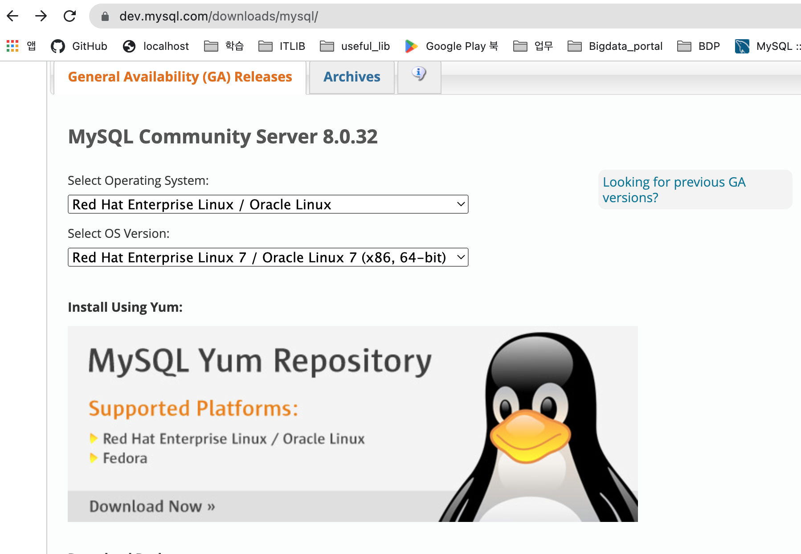
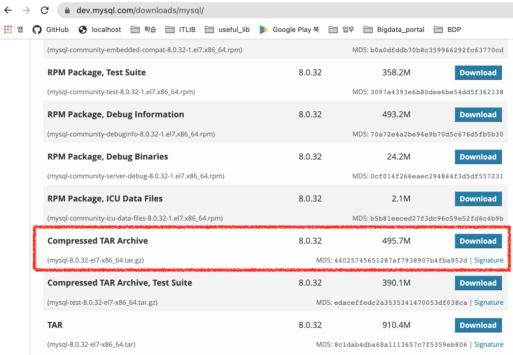

#### Mysql 8.0.32 설치

#### 설치파일 다운로드






1. #### 기존 설치되어 있는 mariadb 삭제

   ```bash
   [root@kcwbigsv03t ~]# rpm -qa | grep maria
   mariadb-libs-5.5.68-1.el7.x86_64
   [root@kcwbigsv03t ~]# rpm -ev --nodeps mariadb-libs-5.5.68-1.el7.x86_64
   Preparing packages...
   mariadb-libs-1:5.5.68-1.el7.x86_64
   [root@kcwbigsv03t ~]# rpm -qa | grep maria
   ```

2. #### mysql 사용자 계정 생성

   ```bash
   [root@kcwbigsv03t ~]# groupadd mysql
   [root@kcwbigsv03t ~]# useradd -g mysql mysql
   [root@kcwbigsv03t ~]# ll /home
   합계 0
   drwx------. 3 kkcomwel kkcomwel 82  2월  9 17:14 kkcomwel
   drwx------. 2 mysql    mysql    62  2월  9 17:39 mysql
   ```

3. #### 서버로 설치파일 업로드

   ```bash
   [root@kcwbigsv03t ~]# ll /home/kkcomwel/upload_files
   합계 507584
   -rw-rw-r--. 1 kkcomwel kkcomwel 519764646  2월  9 17:41 mysql-8.0.32-el7-x86_64.tar.gz
   ```

4. #### 압축해제(1)

   ```bash
   [root@kcwbigsv03t upload_files]# tar -xvf mysql-8.0.32-el7-x86_64.tar.gz
   [root@kcwbigsv03t upload_files]# ll
   합계 507584
   drwxr-xr-x. 9 root     root           129  2월  9 17:43 mysql-8.0.32-el7-x86_64
   -rw-rw-r--. 1 kkcomwel kkcomwel 519764646  2월  9 17:41 mysql-8.0.32-el7-x86_64.tar.gz
   ```

5. #### 설치 경로로 이동 (/usr/local)
   ```bash
   [root@kcwbigsv03t upload_files]# mv mysql-8.0.32-el7-x86_64 /usr/local
   [root@kcwbigsv03t local]# ll
   합계 0
   drwxr-xr-x. 2 root root   6  4월 11  2018 bin
   drwxr-xr-x. 2 root root   6  4월 11  2018 etc
   drwxr-xr-x. 2 root root   6  4월 11  2018 games
   drwxr-xr-x. 2 root root   6  4월 11  2018 include
   drwxr-xr-x. 2 root root   6  4월 11  2018 lib
   drwxr-xr-x. 2 root root   6  4월 11  2018 lib64
   drwxr-xr-x. 2 root root   6  4월 11  2018 libexec
   drwxr-xr-x. 9 root root 129  2월  9 17:43 mysql-8.0.32-el7-x86_64
   drwxr-xr-x. 2 root root   6  4월 11  2018 sbin
   drwxr-xr-x. 5 root root  49  2월  9 16:47 share
   drwxr-xr-x. 2 root root   6  4월 11  2018 src
   ```

6. #### 디렉토리명 변경

   ```bash
   [root@kcwbigsv03t local]# mv mysql-8.0.32-el7-x86_64 mysql
   [root@kcwbigsv03t local]# ll
   합계 0
   drwxr-xr-x. 2 root root   6  4월 11  2018 bin
   drwxr-xr-x. 2 root root   6  4월 11  2018 etc
   drwxr-xr-x. 2 root root   6  4월 11  2018 games
   drwxr-xr-x. 2 root root   6  4월 11  2018 include
   drwxr-xr-x. 2 root root   6  4월 11  2018 lib
   drwxr-xr-x. 2 root root   6  4월 11  2018 lib64
   drwxr-xr-x. 2 root root   6  4월 11  2018 libexec
   drwxr-xr-x. 9 root root 129  2월  9 17:43 mysql
   drwxr-xr-x. 2 root root   6  4월 11  2018 sbin
   drwxr-xr-x. 5 root root  49  2월  9 16:47 share
   drwxr-xr-x. 2 root root   6  4월 11  2018 src
   ```

7. #### 디렉토리 권한 변경(mysql 계정)

   ```bash
   [root@kcwbigsv03t local]# chown -R mysql:mysql mysql
   [root@kcwbigsv03t local]# ll
   합계 0
   drwxr-xr-x. 2 root  root    6  4월 11  2018 bin
   drwxr-xr-x. 2 root  root    6  4월 11  2018 etc
   drwxr-xr-x. 2 root  root    6  4월 11  2018 games
   drwxr-xr-x. 2 root  root    6  4월 11  2018 include
   drwxr-xr-x. 2 root  root    6  4월 11  2018 lib
   drwxr-xr-x. 2 root  root    6  4월 11  2018 lib64
   drwxr-xr-x. 2 root  root    6  4월 11  2018 libexec
   drwxr-xr-x. 9 mysql mysql 129  2월  9 17:43 mysql
   drwxr-xr-x. 2 root  root    6  4월 11  2018 sbin
   drwxr-xr-x. 5 root  root   49  2월  9 16:47 share
   drwxr-xr-x. 2 root  root    6  4월 11  2018 src
   ```

8. #### /APP 디렉토리에 data, logs 디렉토리 생성

   ```bash
   [root@kcwbigsv03t APP]# mkdir mysql
   [root@kcwbigsv03t APP]# cd mysql
   [root@kcwbigsv03t mysql]# mkdir data
   [root@kcwbigsv03t mysql]# mkdir logs
   [root@kcwbigsv03t mysql]# ll
   합계 0
   drwxr-xr-x. 2 root root 6  2월  9 17:53 data
   drwxr-xr-x. 2 root root 6  2월  9 17:53 logs
   [root@kcwbigsv03t mysql]# cd ..
   [root@kcwbigsv03t APP]# chown -R mysql:mysql mysql
   [root@kcwbigsv03t APP]# ll
   합계 0
   drwxr-xr-x. 4 mysql mysql 30  2월  9 17:53 mysql
   [root@kcwbigsv03t APP]# cd mysql
   [root@kcwbigsv03t mysql]# ll
   합계 0
   drwxr-xr-x. 2 mysql mysql 6  2월  9 17:53 data
   drwxr-xr-x. 2 mysql mysql 6  2월  9 17:53 logs
   ```

9. #### my.cnf 파일 생성

   ```bash
   [root@kcwbigsv03t etc]# find / -name my.cnf   # my.cnf 검색
   
   ```

   
