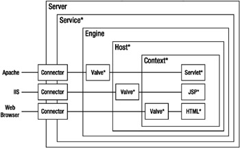

# Apache Tomcat 설치

* Tomcat 시스템 사용자 생성

  * tomcat을 root 사용자로 실행하는 것은 보안상 위험

  * tomcat을 실행할 홈 디렉토리 /opt/tomcat을 사용하여 새 시스템 사용자와 그룹을 생성

    ```shell
    [root@kcwbigsv03t /]# useradd -m -U -d /opt/tomcat -s /bin/false tomcat
    ```

* Tomcat 다운로드

  * 다운로드 : https://tomcat.apache.org/download-90.cgi
  * apache-tomcat-9.0.73.tar.gz

* 서버로 이동

* 압축해제 및 설치 경로로 이동

  ```shell
  [root@kcwbigsv03t upload_files]# tar -xf apache-tomcat-9.0.73.tar.gz
  [root@kcwbigsv03t upload_files]# ll
  합계 114468
  -rw-rw-r--. 1 kkcomwel kkcomwel 105585995  3월 14 22:00 OpenJDK8U-jdk_x64_linux_8u342b07.tar.gz
  drwxr-xr-x. 9 root     root           220  3월 14 22:31 apache-tomcat-9.0.73
  -rw-rw-r--. 1 kkcomwel kkcomwel  11625808  3월 14 22:30 apache-tomcat-9.0.73.tar.gz
  [root@kcwbigsv03t upload_files]# mv apache-tomcat-9.0.73 /opt/tomcat/
  [root@kcwbigsv03t upload_files]# ll /opt/tomcat/
  합계 0
  drwxr-xr-x. 9 root root 220  3월 14 22:31 apache-tomcat-9.0.73
  ```

* 링크 생성

  ```shell
  [root@kcwbigsv03t upload_files]# ln -s /opt/tomcat/apache-tomcat-9.0.73 /opt/tomcat/latest
  [root@kcwbigsv03t upload_files]# cd /opt/tomcat/
  [root@kcwbigsv03t tomcat]# ll
  합계 0
  drwxr-xr-x. 9 root root 220  3월 14 22:31 apache-tomcat-9.0.73
  lrwxrwxrwx. 1 root root  32  3월 14 22:34 latest -> /opt/tomcat/apache-tomcat-9.0.73
  ```

* 소유권 변경,  bin 디렉토리 내의 스크립트 실행 권한 부여

  ```shell
  [root@kcwbigsv03t tomcat]# chown -R tomcat: /opt/tomcat
  [root@kcwbigsv03t tomcat]# sh -c 'chmod +x /opt/tomcat/latest/bin/*.sh'
  ```

* 서비스 등록

# 


# Tomcat 설정

  

- 톰캣설치경로/conf/server.xml : 톰캣 서버 설정 파일
- 톰캣설치경로/conf/web.xml : 톰캣의 모든 프로젝트의 공통설정 파일
- 프로젝트이름/WEB-INF/web.xml : 프로젝트(Context)의 개별 설정




