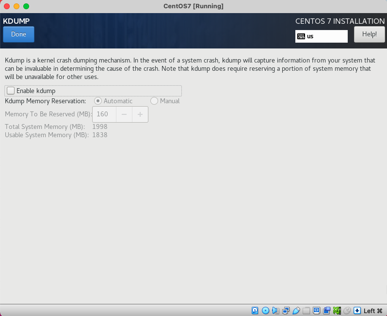

# 1. VirtualBox, CentOS7 설치

### 1. VirtualBox 설치

* VirtualBox 다운로드 : https://www.virtualbox.org/wiki/Downloads

  * VirtualBox 7.0.6 Platform packages
  * macOS / Intel hosts  링크 클릭 후 다운로드

* CentOS7 , ISO 파일 다운로드 : http://ftp.kaist.ac.kr/CentOS/7.9.2009/isos/x86_64/

  * Minimal 버전으로 다운로드 : 

    http://ftp.kaist.ac.kr/CentOS/7.9.2009/isos/x86_64/CentOS-7-x86_64-Minimal-2009.iso
    
    

### 2. VirtualBox CentOS7 가상서버 만들기

#### 네트워크 환경 설정(Host-only Network 추가) : 고정아이피 지정을 위해 추가

#### 가상 머신 만들기 : Skip Unattended Installation 에 체크


#### 서버에 고정 아이피 할당을 위한 어댑터 설정

##### Host-only Networks를 추가 


##### 어댑터1에 포트포워딩 설정을 한다


##### 어댑터 2 : Host-only Network와 연결한다. (Host-only adapter가 deprecated 됨)


######  어댑터2의 Mac주소는 서버에서 사용하므로 기록해 둔다


### 3. 가상머신 시작 (CentOS 설치)

###### 설정이 완료되면, 가상머신을 시작하여 OS 설치를 진행한다




###### Enable kdump에 체크를 해제한다


##### root 패스워드는 지정


##### 사용자를 추가한다 kkcomwel


### 4. CentOS7 설정

#### 고정 아이피 할당

##### 아이피 주소, 어댑터 설정 확인(모두 설정이 완료된 상태)

```bash
[root@kcwbigsv01t network-scripts]# ip addr
1: lo: <LOOPBACK,UP,LOWER_UP> mtu 65536 qdisc noqueue state UNKNOWN group default qlen 1000
    link/loopback 00:00:00:00:00:00 brd 00:00:00:00:00:00
    inet 127.0.0.1/8 scope host lo
       valid_lft forever preferred_lft forever
    inet6 ::1/128 scope host
       valid_lft forever preferred_lft forever
2: enp0s3: <BROADCAST,MULTICAST,UP,LOWER_UP> mtu 1500 qdisc pfifo_fast state UP group default qlen 1000
    link/ether 08:00:27:fc:2e:bc brd ff:ff:ff:ff:ff:ff
    inet 10.0.2.15/24 brd 10.0.2.255 scope global noprefixroute dynamic enp0s3
       valid_lft 85146sec preferred_lft 85146sec
    inet6 fe80::49a5:b826:8743:3a41/64 scope link noprefixroute
       valid_lft forever preferred_lft forever
3: enp0s8: <BROADCAST,MULTICAST,UP,LOWER_UP> mtu 1500 qdisc pfifo_fast state UP group default qlen 1000
    link/ether 08:00:27:0a:78:f3 brd ff:ff:ff:ff:ff:ff
    inet 192.168.56.101/24 brd 192.168.56.255 scope global noprefixroute enp0s8
       valid_lft forever preferred_lft forever
    inet6 fe80::c12:d8:829a:c5aa/64 scope link noprefixroute
       valid_lft forever preferred_lft forever
```

###### /etc/sysconfig/network-scripts/ifcfg-enp0s3

```bash
TYPE="Ethernet"
PROXY_METHOD="none"
BROWSER_ONLY="no"
BOOTPROTO="dhcp"
DEFROUTE="yes"
IPV4_FAILURE_FATAL="no"
IPV6INIT="yes"
IPV6_AUTOCONF="yes"
IPV6_DEFROUTE="yes"
IPV6_FAILURE_FATAL="no"
IPV6_ADDR_GEN_MODE="stable-privacy"
NAME="enp0s3"
UUID="6917f17d-8d61-48ef-be51-9f1b6b7f9afa"
DEVICE="enp0s3"
ONBOOT="yes"       # yes로 변경한다
```

###### ONBOOT를 yes로 변경후, 가상머신을 강제 종료 하고, 다시 시작한다 

###### /etc/sysconfig/network-scripts/ifcfg-enp0s8 

```bash
TYPE=Ethernet
PROXY_METHOD=none
BROWSER_ONLY=no
BOOTPROTO=static											# 고정 아이피 설정
DEFROUTE=yes
IPV4_FAILURE_FATAL=no
IPV6INIT=yes
IPV6_AUTOCONF=yes
IPV6_DEFROUTE=yes
IPV6_FAILURE_FATAL=no
IPV6_ADDR_GEN_MODE=stable-privacy
NAME=enp0s8
UUID=065f9838-f82c-4910-98c2-f38f514bd3a0
DEVICE=enp0s8
ONBOOT=yes
IPADDR=192.168.56.101
HWADDR=08:00:27:0A:78:F3               # VirtualBox의 어댑터2 설정
NETMASK=255.255.255.0
GATEWAY=192.168.56.1
NETWORK=192.168.56.0
```

------

#### (참고) SSH 사용하도록 설정

###### 여기까지만 설정해도 Mac에서 iterm으로 ssh 접속이 가능하다

```bash
$ ssh root@192.168.56.101
root@192.168.56.101's password:
Last login: Mon Feb  6 05:33:16 2023 from gateway
[root@kcwbigsv01t ~]#
```

###### 확인해 보면 이미 실행 되고 있음

```shell
[root@kcwbigsv01t ~]# systemctl status sshd
● sshd.service - OpenSSH server daemon
   Loaded: loaded (/usr/lib/systemd/system/sshd.service; enabled; vendor preset: enabled)
   Active: active (running) since 월 2023-02-06 05:31:30 EST; 58min ago
     Docs: man:sshd(8)
           man:sshd_config(5)
 Main PID: 1038 (sshd)
   CGroup: /system.slice/sshd.service
           └─1038 /usr/sbin/sshd -D

 2월 06 05:32:36 kcwbigsv01t sshd[1296]: input_userauth_request: invalid user chan [preauth]
 2월 06 05:32:43 kcwbigsv01t sshd[1296]: pam_unix(sshd:auth): check pass; user unknown
 2월 06 05:32:43 kcwbigsv01t sshd[1296]: pam_unix(sshd:auth): authentication failure; logname= uid=0 euid=0 t...teway
 2월 06 05:32:45 kcwbigsv01t sshd[1296]: Failed password for invalid user chan from 192.168.56.1 port 52787 ssh2
 2월 06 05:32:50 kcwbigsv01t sshd[1296]: pam_unix(sshd:auth): check pass; user unknown
 2월 06 05:32:52 kcwbigsv01t sshd[1296]: Failed password for invalid user chan from 192.168.56.1 port 52787 ssh2
 2월 06 05:32:57 kcwbigsv01t sshd[1296]: pam_unix(sshd:auth): check pass; user unknown
 2월 06 05:32:59 kcwbigsv01t sshd[1296]: Failed password for invalid user chan from 192.168.56.1 port 52787 ssh2
 2월 06 05:33:16 kcwbigsv01t sshd[1298]: Accepted password for root from 192.168.56.1 port 52790 ssh2
 2월 06 06:28:44 kcwbigsv01t sshd[8847]: Accepted password for root from 192.168.56.1 port 52841 ssh2
Hint: Some lines were ellipsized, use -l to show in full.
```

###### rpm으로 업그레이드 할 수 있다. 

###### 서비스를 확인하는 방법

```shell
[root@kcwbigsv01t ~]# which ssh
/usr/bin/ssh
[root@kcwbigsv01t ~]# systemctl enable sshd.service
[root@kcwbigsv01t ~]# service network restart
Restarting network (via systemctl):                        [  OK  ]
```

###### mac에서 접속 확인

```bash
 ~/workspace $ ssh root@192.168.56.101
root@192.168.56.101's password:
Last login: Mon Feb  6 06:28:44 2023 from gateway
[root@kcwbigsv01t ~]# exit
logout
Connection to 192.168.56.101 closed.


 ~/workspace $ sftp root@192.168.56.101
root@192.168.56.101's password:
Connected to 192.168.56.101.
sftp>
```


